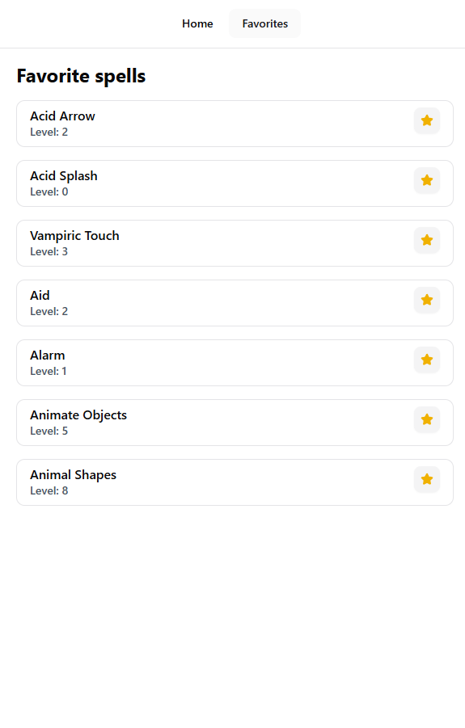

# Spell App

A small web app built using React and TypeScript that lets users browse spells from the [Dungeons & Dragons 5th Edition API](https://www.dnd5eapi.co/), view spell details, and save their favorite spells.

## Features

- Spell list page
  Browse all available spells from the API with a simple search/filter option.
- Spell details page
  Click on any spell to see full details
- Favorite spells page
  Mark spells as favorites. Favorites are stored in localStorage so they persist between sessions.

## Tech Stack

- React and typescript using vite
- Tailwind css along with Shadcn UI
- [D&D 5e API](https://www.dnd5eapi.co/)

## Getting Started

```bash
1. Clone the repo
git clone https://github.com/JemyJenesh/Jenesh-Pradhananga-SpellApp

2. Install dependencies
cd Jenesh-Pradhananga-SpellApp
pnpm install

3. Run locally
pnpm dev
```

## Pages

### Spell list


### Spell details


### Favorite spells


